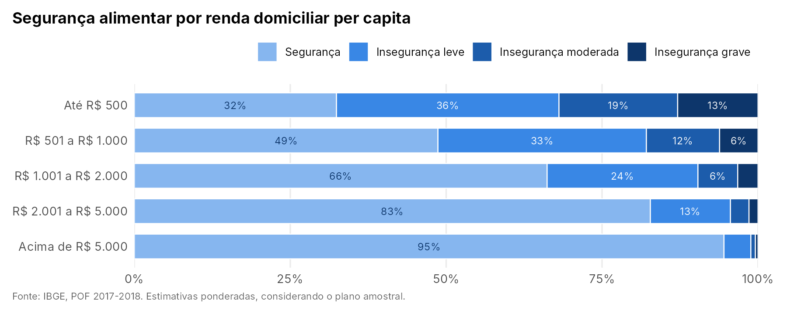

# Insegurança alimentar e perfil socioeconômico no Brasil (POF 2017-2018)

Estimativas da insegurança alimentar nos domicílios brasileiros segundo renda, escolaridade, características demográficas e território, com os microdados da Pesquisa de Orçamentos Familiares (POF/IBGE) e o plano amostral complexo da pesquisa.



**Resultado principal:** a insegurança alimentar acompanha a renda de perto. Nos domicílios com renda per capita de até R$ 500, só 32% estão em segurança alimentar e 13% em insegurança grave. Acima de R$ 5.000, 95% estão em segurança e a insegurança grave fica abaixo de 1%.

---

## Pergunta

Como a segurança alimentar dos domicílios brasileiros varia segundo renda, escolaridade, idade, sexo, cor ou raça da pessoa de referência, composição familiar e localização?

## Dados

| | |
|---|---|
| **Fonte** | [POF 2017-2018, IBGE](https://www.ibge.gov.br/estatisticas/sociais/saude/24786-pesquisa-de-orcamentos-familiares-2.html) (microdados públicos) |
| **Desfecho** | Escala Brasileira de Insegurança Alimentar (EBIA): segurança, insegurança leve, moderada e grave |
| **Unidade de análise** | Domicílio; características individuais referem-se à pessoa de referência |
| **Amostra** | 57.920 domicílios |
| **Registros usados** | MORADOR e DOMICILIO |

## Estratégia empírica

1. **Plano amostral:** estratos (`ESTRATO_POF`), conglomerados (`COD_UPA`) e pesos (`PESO_FINAL`) declarados com o pacote `survey`. Sem isso, os erros-padrão saem subestimados.
2. **Distribuições univariadas** ponderadas, com erro-padrão, intervalo de confiança de 95% e coeficiente de variação.
3. **Perfis bivariados:** distribuição da segurança alimentar dentro de cada categoria das variáveis socioeconômicas.
4. **Teste de associação:** qui-quadrado com correção de Rao-Scott, adequado a amostras complexas.

A análise é descritiva: as associações não têm interpretação causal. Detalhes de cada etapa em [`docs/metodologia.md`](docs/metodologia.md).

## Validação

As estimativas reproduzem a divulgação oficial do IBGE para a POF 2017-2018:

| Situação do domicílio | Este repositório | IBGE |
|---|---:|---:|
| Segurança alimentar | 63,3% | 63,3% |
| Insegurança leve | 24,0% | 24,0% |
| Insegurança moderada | 8,1% | 8,1% |
| Insegurança grave | 4,6% | 4,6% |

## Outros resultados

| Recorte | Gráfico |
|---|---|
| Nível de instrução | [ver](output/figures/seguranca_por_nivel_instrucao_desc.png) |
| Cor ou raça | [ver](output/figures/seguranca_por_cor_raca_desc.png) |
| Sexo | [ver](output/figures/seguranca_por_sexo_desc.png) |
| Idade | [ver](output/figures/seguranca_por_faixa_idade.png) |
| Composição familiar | [ver](output/figures/seguranca_por_composicao_familiar_desc.png) |
| Grande região | [ver](output/figures/seguranca_por_grande_regiao_desc.png) |
| Unidade da federação | [ver](output/figures/seguranca_por_uf_desc.png) |
| Situação urbano/rural | [ver](output/figures/seguranca_por_urbano_rural_desc.png) |

Tabelas completas, com erros-padrão, intervalos de confiança, coeficientes de variação e testes: [`output/tables/resultados.xlsx`](output/tables/resultados.xlsx) (também em `.csv` na mesma pasta).

## Estrutura

```
├── run_all.R                 # executa tudo
├── R/
│   └── funcoes.R             # recodificação, plano amostral, tabelas e gráficos
├── analysis/
│   ├── 01_preparar_dados.R   # microdados → base de domicílios
│   └── 02_analise.R          # estimativas, testes, gráficos e tabelas
├── data/
│   ├── raw/                  # microdados do IBGE (não versionados)
│   └── processed/            # base analítica pronta (.rds e .csv.gz)
├── output/
│   ├── figures/
│   └── tables/
└── docs/
    └── metodologia.md
```

## Como reproduzir

**Caminho rápido.** A base analítica já vem no repositório ([`data/processed/`](data/processed/LEIAME.md)). Clone e execute, na raiz:

```r
source("run_all.R")
```

**Do zero, a partir dos microdados do IBGE.** Baixe os microdados da POF 2017-2018 e rode o programa de leitura do IBGE (passo a passo em [`data/raw/LEIAME.md`](data/raw/LEIAME.md)). Copie `MORADOR.rds` e `DOMICILIO.rds` para `data/raw/` e execute o mesmo comando: com os microdados presentes, a base é refeita antes da análise.

Requer R ≥ 4.1 e os pacotes `dplyr`, `ggplot2`, `survey` e `writexl` (instalados automaticamente se faltarem).

## Próximos passos

- Incluir as condições de saneamento e energia elétrica, já presentes na base preparada.
- Estimar modelos de regressão ordinal com o plano amostral (`svyolr`), para medir a associação de cada fator controlando pelos demais.

## Autor

**Alexandre Saldanha**, economista e mestrando em População, Território e Estatísticas Públicas (ENCE/IBGE).
[LinkedIn](https://www.linkedin.com/in/alexandre-saldanha-202a8592/) · [Lattes](http://lattes.cnpq.br/5148309722351266)

Projeto desenvolvido em consultoria estatística para uma pesquisa de mestrado em Saúde Coletiva.

Código sob licença [MIT](LICENSE). Dados: IBGE, POF 2017-2018 (microdados públicos).
